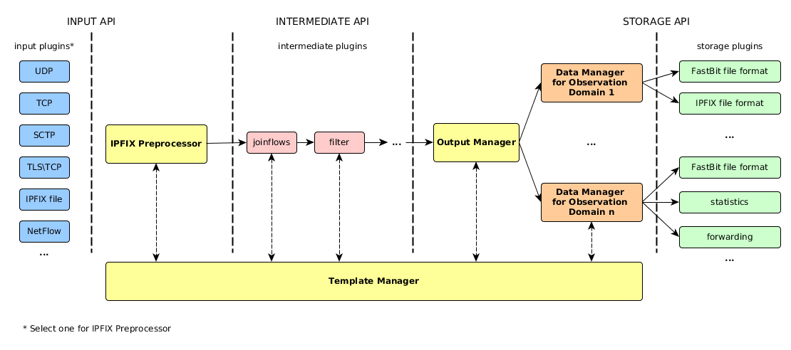

##What is IPFIXcol

IPFIXcol is a flexible IPFIX flow data collector designed to be easily extensible by plugins.

It loads input, intermediate and output plugins on startup. Each input plugin runs in a different process.

IPFIXcol corresponds to [RFC501](http://tools.ietf.org/html/rfc5101)

##Configuration

IPFIXcol stores its configuration in the **/etc/ipfixcol/** directory.

* **ipfix-elements.xml** contains a description of the known IPFIX elements assigned by IANA (http://www.iana.org/assignments/ipfix/ipfix.xml).

* **internalcfg.xml** contains configuration of plugins used in startup.xml. Can be viewed/edited with **ipfixconf** tool.

* **startup.xml** describes how IPFIXcol is configured at startup, which plugins are used and where the data will be stored. The XML is self-documented, so read the elements description carefully. The collector will listen on TCP, UDP and SCTP on startup by default, so be careful to configure which plugin you want to use before starting it.

##Built-in plugins
###Input plugins

* **TCP**, **UDP** and **SCTP** plugin are provided accept data from the network. Each can be configured to listen on a specific interface and a port. They are compatible with IPFIX, Netflow v5, Netflow v9 and sFlow.

* **IPFIX file** format input plugin can read data from a file in the mentioned format and store them in any other, depending on the storage plugin used. The IPFIX file format is specified in [RFC5655](http://tools.ietf.org/html/rfc5655).

###Intermediate plugins

* **anonymization** - anonymizes IP addresses with Crypto-PAn algorithm.

* **dummy** only passed message to next plugin.

* **filter** goes through data records and filters them according to profiles set in **startup.xml**. User can specify profiles with source Observation Domain IDs (ODID), output ODID and filter string.

* **joinflows** plugin merges multiple flows into one and adds information about original ODID to each Template and Data record.

##External plugins
External plugins are described in the main [README](../README.md).

###Storage plugins

* **IPFIX file** format storage plugin stores data in the IPFIX format in flat files. The storage path must be configured in **startup.xml** to determine where to store the data.

* **ipfixviewer** storage plugin displays captured ipfix data (doesn't store them).

* **dummy** storage plugin does not store any data. It is available for collector performance testing purposes only. The time that plugins spends in _store_packet_ function can be configured.

* **forwarding** plugin sends data over the network (e.g. to the next collector). There is configurable connection type (TCP, UDP or SCTP), destination port and IPv4 or IPv6 address. With UDP, template refresh time etc. can be set.

## Other tools
###ipfixviewer
A tool for displaying captured ipfix data. Uses IPFIXcol, IPFIX file input plugin and ipfixviewer storage plugin.

###ipfixconf
This tool provides interface to list, add and remove plugins from internal configuration so you don't need to edit XML file manualy. Each external plugin uses this tool after succesfull installation.
